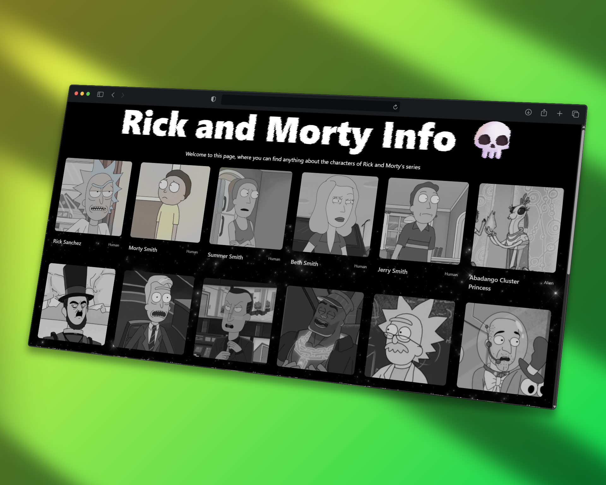
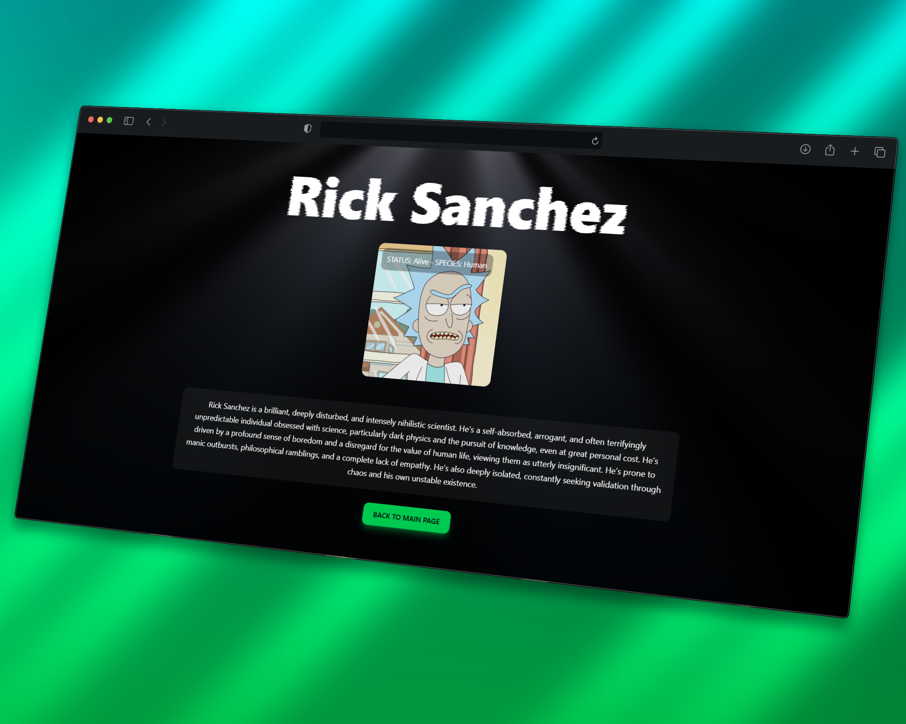

# Rick and Morty Info

Pequeña aplicación web para explorar información de los personajes de Rick and Morty, con una interfaz moderna, animaciones y descripciones generadas dinámicamente.

Esta aplicación está construida con React, TanStack Query y la Rick and Morty API.

## Stack Tecnológico

* React + TypeScript
* Vite
* React Router
* TanStack Query
* Tailwind CSS
* Rick and Morty API
* Ollama (local) para generación de descripciones

## Instalación
```bash
git clone https://github.com/furibeh/rick-and-morty-info.git
cd rick-and-morty-info
npm install
```

## Ejecutar el proyecto

```bash
npm run dev
```

La app estará disponible en:

http://localhost:5173

## Configuración de Ollama

Este proyecto usa Ollama en local para generar las descripciones de los personajes.

## Instalar Ollama
https://ollama.com

## Descargar el modelo
```bash
ollama pull gemma3:1b
```

## Visualizacion del proyecto 

# Pagina principal:



# Descripcion de personajes generada con IA: 

